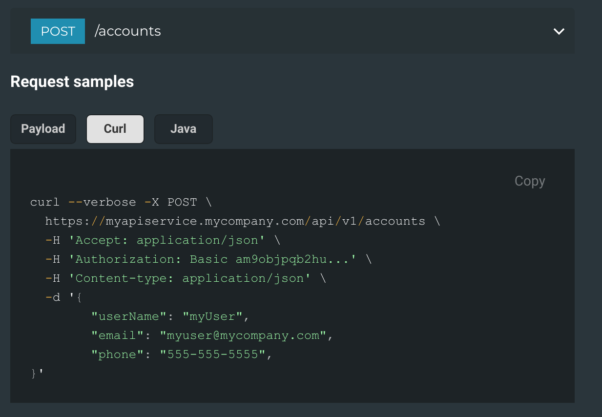

# Springfox Code Sample Annotations
Easily add code samples to your Springfox + ReDoc API documentation with these annotations and 
Springfox extension.

Idea courtesy of https://github.com/hugol1ma. (https://github.com/Rebilly/ReDoc/issues/376#issuecomment-353964455).

## Usage

```java
    @ApiOperation( value = "Create account",
                   nickname = "createAccount",
                   notes = "Create a new account",
                   response = Account.class,
                   authorizations = {
                         @Authorization( value = "ApiKey" )
                   },
                   tags = { "Accounts" }
    )
    @ApiResponses( value = {
          @ApiResponse( code = 201,
                        message = "Account created successfully",
                        response = Account.class ) } )
    @ApiCodeSamples( samples = {
          @ApiCodeSample( lang = "Curl",
                          source = "curl --verbose -X POST \\\n" +
                                   "  https://myapiservice.mycompany.com/api/v1/accounts \\\n" +
                                   "  -H 'Accept: application/json' \\\n" +
                                   "  -H 'Authorization: Basic am9objpqb2hu...' \\\n" +
                                   "  -H 'Content-type: application/json' \\\n" +
                                   "  -d '{\n" +
                                   "\t\"userName\": \"myUser\",\n" +
                                   "\t\"email\": \"myuser@mycompany.com\",\n" +
                                   "\t\"phone\": \"555-555-5555\",\n" +
                                   "}'" ),
          @ApiCodeSample( lang = "Java",
                          source = "OkHttpClient client = new OkHttpClient();\n" +
                                   "\n" +
                                   "MediaType mediaType = MediaType.parse(\"application/json\");\n" +
                                   "RequestBody body = RequestBody.create(mediaType, \"{\\\"userName\\\": \\\"myUser\\\",\\\"email\\\": \\\"myuser@mycompany.com\\\",\\\"phone\\\": \\\"555-555-5555\\\"}\");\n" +
                                   "Request request = new Request.Builder()\n" +
                                   "  .url(\"https://myapiservice.mycompany.com/api/v1/accounts\")\n" +
                                   "  .post(body)\n" +
                                   "  .addHeader(\"content-type\", \"application/json\")\n" +
                                   "  .addHeader(\"accept\", \"application/json\")\n" +
                                   "  .addHeader(\"authorization\", \"Basic am9objpqb2hu...\")\n" +
                                   "  .build();\n" +
                                   "\n" +
                                   "Response response = client.newCall(request).execute();")
    } )
    @ResponseStatus( HttpStatus.CREATED )
    @RequestMapping( value = "/accounts",
                     produces = { "application/json" },
                     consumes = { "application/json" },
                     method = RequestMethod.POST )
    public ResponseEntity<Account> createAccount( final Authentication authentication,
                                                  @ApiParam( value = "Account to create." ) @Valid @RequestBody final Account account )
    {
        // Do stuff....


        return new ResponseEntity<>( account, HttpStatus.CREATED );
    }
```

## ReDoc Output




## Live Example

If you'd like to see the full ReDoc example, just start the app server and
then visit http://localhost:8080/index.html.
```
./gradlew bootRun
```
